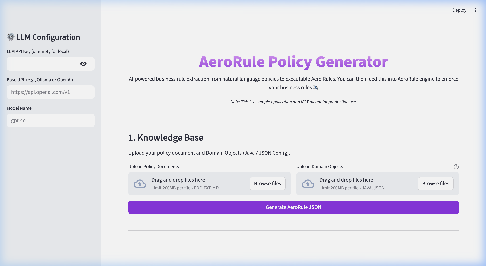

# AeroRule 🛩️

AeroRule is a performant, polyglot rules engine focused on LLM compatibility, CEL (Common Expression Language) logic, and cross-language traceability.

## The Problem It Solves

Modern applications require dynamic, configurable business logic. However:
1. **Hardcoded logic** requires frequent redeployments and is difficult for non-engineers to understand or audit.
2. **Traditional Rule Engines** are often heavy, language-specific, and have complex, proprietary formats.
3. **LLM Integration is Risky:** Asking an LLM to generate raw executable code (like Java or Python) for dynamic business rules introduces immense security, reliability, and injection risks.

**AeroRule's Solution:** 
AeroRule completely decouples rules from your codebase using a standardized **JSON Schema** where conditions are evaluated safely via **CEL (Common Expression Language)**.
- **Secure:** CEL is secure, non-Turing complete, and incredibly fast.
- **Polyglot:** Rule definitions and trace evaluations behave identically across Java and Python.
- **LLM-Native:** LLMs are exceptionally good at generating JSON and CEL, making it trivial to build natural-language-to-rule pipelines that are safe to execute in production.

## How to Use It

AeroRule currently provides full support for **Java** and **Python**.

### Java Integration (`aero-core`)

AeroRule provides a Maven/Gradle-compatible library for Java.

```java
import com.aerorule.core.*;
import java.util.Map;
import java.util.List;

// 1. Initialize rules from your file system (or database)
FileSystemProvider provider = new FileSystemProvider("/path/to/rules");
List<Rule> rules = provider.getRules();

// 2. Evaluate a rule against an execution context
RuleEvaluator evaluator = new RuleEvaluator(rules.get(0));
Trace trace = evaluator.evaluate(Map.of(
    "user", Map.of("age", 20, "status", "ACTIVE")
));

System.out.println("Condition matched: " + trace.isMatched());
System.out.println("Action taken: " + trace.getActionTaken());
System.out.println("Execution time (ms): " + trace.getExecutionTimeMs());

// 3. (Optional) Evaluate using POJOs directly
Customer customer = new Customer("CUST-100", 600, 8000000L);
Trace pojoTrace = evaluator.evaluateWithObjects(Map.of("customer", customer));
```

### Python Integration (`aero-python`)

AeroRule offers a Poetry-managed package for Python featuring an intuitive decorator-based API.

```python
from aerorule import aerorule

my_rule = {
    "id": "adult-check",
    "condition": "user.age >= 18",
    "onSuccess": {"action": "ALLOW"},
    "onFailure": {"action": "DENY"}
}

# The decorator automatically evaluates the rule against the function's arguments
@aerorule(my_rule)
def process_user(user: dict):
    return {"status": "Processing allowed user", "user": user}

# Evaluation happens automatically when called
result = process_user(user={"age": 20})
```

## RuleSet Engine

While individual rules are useful, real-world policies involve **multiple rules evaluated together**. AeroRule provides a **RuleSet Engine** that groups rules and evaluates them using configurable execution strategies.

### Execution Strategies

| Strategy | Behavior | Use Case |
|----------|----------|----------|
| `ALL` | Run every rule, collect all traces. | Audit / compliance reporting. |
| `GATED` | Run in order, **stop on first failure**. | Sequential approval gates. |

### Example RuleSet (`GATED` Strategy)

```json
{
  "id": "loan-origination-v1",
  "name": "Loan Origination Policy",
  "executionStrategy": "GATED",
  "rules": [
    { "id": "CREDIT-001", "condition": "customer.creditScore >= 680",
      "onSuccess": { "action": "PASS" }, "onFailure": { "action": "DECLINE" } },
    { "id": "INCOME-001", "condition": "customer.annualIncome >= 40000",
      "onSuccess": { "action": "PASS" }, "onFailure": { "action": "DECLINE" } },
    { "id": "LTV-001", "condition": "loan.amount <= customer.annualIncome * 5",
      "onSuccess": { "action": "APPROVE_LOAN" }, "onFailure": { "action": "FLAG_FOR_REVIEW" } }
  ]
}
```

### Python Usage

```python
from aerorule import RuleSetEngine

engine = RuleSetEngine.from_file("rules/loan-origination-v1.json")
result = engine.evaluate({
    "customer": {"creditScore": 720, "annualIncome": 85000},
    "loan": {"amount": 250000}
})

print(result.passed)       # True
print(result.summary)      # "3/3 rules passed"
print(len(result.traces))  # 3 individual Trace objects
```

*See a full runnable example in [`Samples/python/run_ruleset.py`](AeroRule/Samples/python/run_ruleset.py).*

### Java Usage

```java
import com.aerorule.core.engine.*;

RuleSetEngine engine = RuleSetEngine.fromFile("rules/loan-origination-v1.json");
RuleSetTrace result = engine.evaluate(Map.of(
    "customer", Map.of("creditScore", 720, "annualIncome", 85000),
    "loan", Map.of("amount", 250000)
));

System.out.println(result.isPassed());   // true
System.out.println(result.getSummary()); // "3/3 rules passed"
```

### CLI Usage

```bash
aero run ruleset loan-origination-v1.json --context context.json
```

## Financial Services Use Cases

AeroRule is exceptionally well-suited for Financial Services where audibility, complex arithmetic, and strict condition evaluations are required without complex deployment cycles.

Here are a few ways AeroRule can be applied in the financial sector:

### 1. Loan Origination (Credit & Income Eligibility)
Evaluate if a commercial customer meets requirements for loan approval.
```json
{
  "id": "CREDIT-001",
  "description": "Evaluate if a commercial customer meets requirements for loan approval.",
  "condition": "customer.riskScore < 700 && customer.annualRevenue > 5000000 && account.type == \"COMMERCIAL\"",
  "onSuccess": { "action": "APPROVE_LOAN" },
  "onFailure": { "action": "DENY_LOAN" }
}
```

### 2. Anti-Money Laundering (AML)
Flag large transactions exceeding regulatory thresholds.
```json
{
  "id": "AML-TX-001",
  "condition": "transaction_amount > 10000.0",
  "onSuccess": { "action": "SUBMIT_STR" },
  "onFailure": { "action": "LOG_COMPLIANT" }
}
```

### 3. Know Your Customer (KYC)
Ensure a customer is verified and their account has existed long enough before granting sensitive access.
```json
{
  "id": "KYC-001",
  "condition": "kyc_verified == true && account_age > 90",
  "onSuccess": { "action": "GRANT_ACCESS" },
  "onFailure": { "action": "REQUIRE_VERIFICATION" }
}
```


## Samples

The [`Samples/`](Samples/) directory contains end-to-end examples showing AeroRule in action.

### 🖥️ Policy Generator App (`Samples/policy-generator-app`)

The **AeroRule Policy Generator** is an AI-powered Streamlit web app that converts natural-language policy documents into executable AeroRule JSON rules. It demonstrates the full LLM-to-rule pipeline in a visual, interactive interface.

**How it works:**
1. **Upload a Policy Document** — provide a plain-text or PDF policy file. The sample uses [`SampleCreditPolicy.txt`](Samples/policy-generator-app/SampleCreditPolicy.txt), which defines a lending policy with clauses such as:
   - Restricted industries (Gambling, Cannabis) → auto-decline
   - Commitment vs. Revenue threshold → flag for manual review
   - Minimum risk score (500) → decline if below
2. **Upload Domain Objects** — provide your Java POJOs or JSON config files as context so the LLM understands your data model. The sample uses:
   - [`Customer.java`](Samples/policy-generator-app/Customer.java) — fields: `industry`, `totalRevenue`, `riskScore`
   - [`Deal.java`](Samples/policy-generator-app/Deal.java) — fields: `totalCommitment`, `status`
3. **Generate AeroRule JSON** — the app calls an LLM (OpenAI, Anthropic, Gemini, or Ollama) and extracts structured AeroRule rules with full CEL conditions, source quotes, and traceability back to the original document.
4. **Interactive Review** — click any generated rule to highlight the source text that informed it. Download individual rules or the full rule set.



**To run the sample:**
```bash
cd Samples/policy-generator-app
pip install -r requirements.txt
streamlit run app.py
```

---

## Connecting AeroRule with an LLM

Because AeroRule uses strict JSON schemas and Google's Common Expression Language, you can easily use an LLM (such as OpenAI, Anthropic, Gemini, etc.) to generate or modify your business rules dynamically.

Just provide the LLM with the following system prompt and schema context:

```text
You are an expert system rule generator. Map user requirements to AeroRule JSON structures.
Output valid JSON matching the `Rule` schema. The `condition` must be written in Google CEL (Common Expression Language).

Schema context:
- `id`: String (unique identifier)
- `description`: String (human-readable purpose)
- `priority`: Integer (higher executes earlier)
- `condition`: String (CEL expression, e.g., `user.age >= 18 && user.status == "ACTIVE"`)
- `onSuccess`: Object with `action` (String) and `metadata` (Object)
- `onFailure`: Object with `action` (String) and `metadata` (Object)
```

### Example

**User Prompt:**
>"Create a rule that denies the transaction if the cart total is greater than $500 and the user is unverified."

**LLM Output:**
```json
{
  "id": "high-value-unverified-deny",
  "description": "Deny transaction if cart total > 500 and user is unverified",
  "priority": 100,
  "condition": "cart.total > 500 && user.verified == false",
  "onSuccess": {
    "action": "DENY"
  },
  "onFailure": {
    "action": "ALLOW"
  }
}
```

This JSON rule can immediately be loaded into your Java or Python application and safely evaluated using AeroRule without writing any custom parsing!
