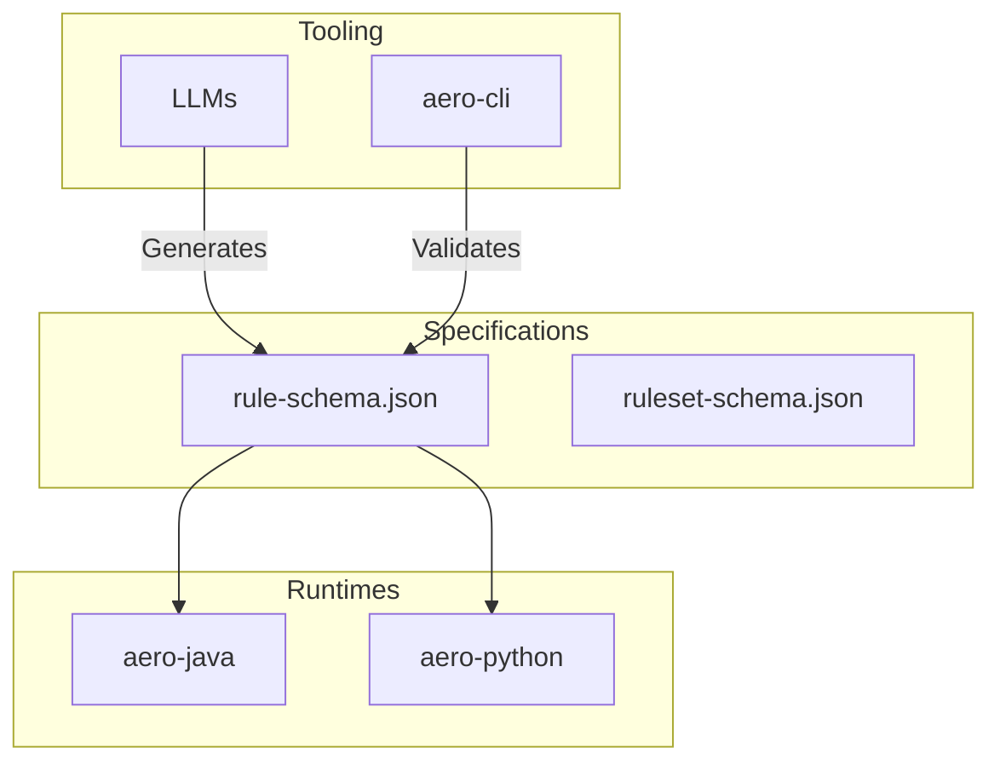

# AeroRule Integration Guide

AeroRule is a polyglot rules engine designed for high-performance and LLM-centric workflows using CEL (Common Expression Language).

## Architecture Overview

AeroRule decouple rules from code. Rules are defined in a standardized JSON schema, evaluated safely across different runtime environments.



## CEL Primer

Google's Common Expression Language (CEL) is a non-Turing complete, memory-safe expression language. It is ideal for evaluating business rules safely.

### Syntax Examples

- **Comparisons**: `user.age >= 18 && user.score < 700`
- **String Matching**: `user.email.endsWith("@company.com")`
- **List Operations**: `transaction.amount in [100, 200, 300]`
- **Macros**: `users.all(u, u.age >= 18)` or `users.exists(u, u.name == "admin")`

Variables exposed in the CEL condition map exactly to the keys in your execution context map.

## Java Integration

AeroRule provides a Maven/Gradle-compatible library for Java.

### Evaluating Individual Rules
```java
import com.aerorule.core.*;

// 1. Initialize from file
FileSystemProvider provider = new FileSystemProvider("/path/to/rules");
List<Rule> rules = provider.getRules();

// 2. Evaluate
RuleEvaluator evaluator = new RuleEvaluator(rules.get(0));
Trace trace = evaluator.evaluate(Map.of("user", Map.of("age", 20)));

System.out.println("Matched? " + trace.isMatched());
System.out.println("Action:  " + trace.getActionTaken());
```

### Evaluating RuleSets
```java
import com.aerorule.core.engine.*;

RuleSetEngine engine = RuleSetEngine.fromFile("rules/loan-origination-v1.json");
RuleSetTrace result = engine.evaluate(Map.of(
    "customer", Map.of("creditScore", 720, "annualIncome", 85000),
    "loan", Map.of("amount", 250000)
));

System.out.println(result.isPassed());   // true
```

## Python Integration

AeroRule offers a Poetry-managed package for Python featuring an intuitive API.

### Decorator Pattern
```python
from aerorule import aerorule

my_rule = {
    "id": "adult-check",
    "condition": "user.age >= 18",
    "onSuccess": {"action": "ALLOW"},
    "onFailure": {"action": "DENY"}
}

@aerorule(my_rule)
def process_user(user: dict):
    return {"status": "success", "user": user}

# Evaluation happens automatically
result = process_user(user={"age": 20})
```

### RuleSet Engine Pattern
```python
from aerorule.engine import RuleSetEngine

engine = RuleSetEngine.from_file("rules/loan-origination-v1.json")
result = engine.evaluate({
    "customer": {"creditScore": 720, "annualIncome": 85000},
    "loan": {"amount": 250000}
})

print(result.passed)
```

## LLM System Prompt for Rule Generation

When prompting an LLM to generate rules, use the following context:

> You are an expert system rule generator. Map user requirements to AeroRule JSON structures.
> Output valid JSON matching the `Rule` schema. The `condition` must be written in Google CEL (Common Expression Language).
> 
> Schema context:
> - `id`: String (unique)
> - `priority`: Integer
> - `condition`: String (CEL expression, e.g., `user.age >= 18 && user.status == "ACTIVE"`)
> - `onSuccess`: Object with `action` (String) and `metadata` (Object)
> - `onFailure`: Object with `action` (String) and `metadata` (Object)
